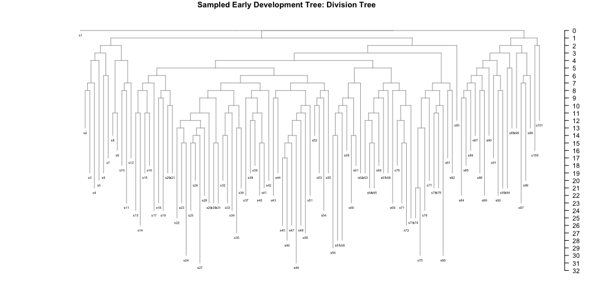
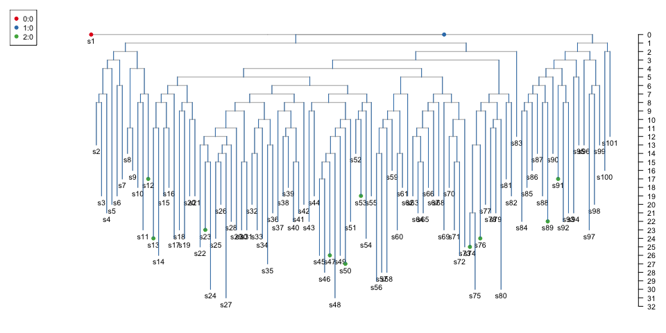
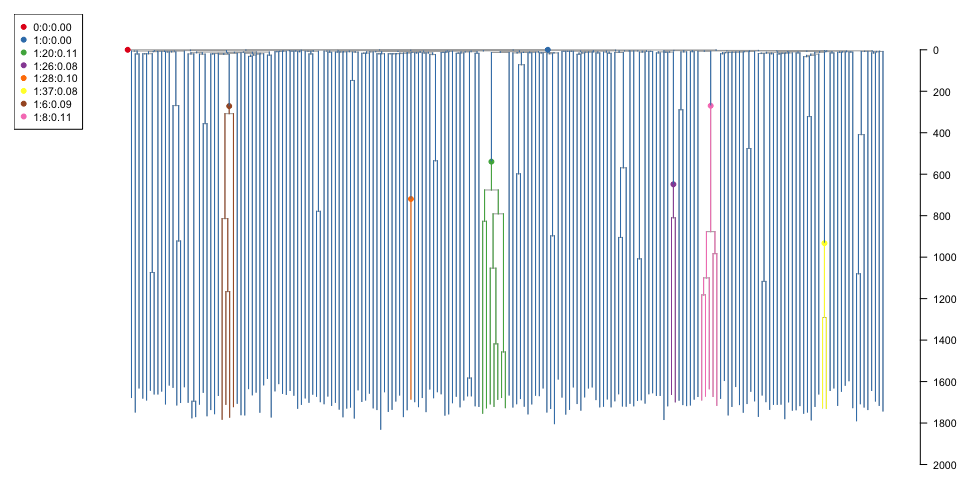
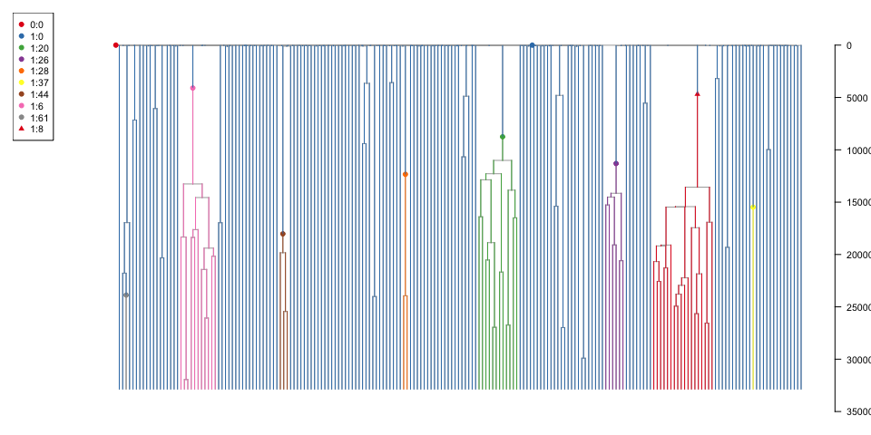
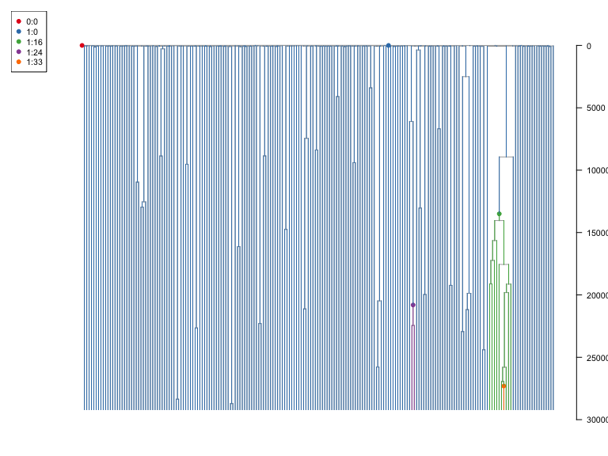

11/01/2022

<!-- README.md is generated from README.Rmd. Please edit that file -->
# rsimpop

<!-- badges: start -->
<!-- badges: end -->
## Installation

You can install rsimpop like so:

``` r
devtools::install_github("nangalialab/rsimpop")
```

Or clone the repository and install using the downloaded package tar file

``` r
install.packages("somedirectory/rsimpop/rsimpop_2.2.4.tar.gz",repos=NULL)
```

## rsimpop

This package implements Gillespie Algorithm implementation of the Birth-Death model that allows the simultaneous simulation of multiple cellular compartments each with their own time varying-target population size and sub-compartments with differential fitness (driver compartments).

## Simulate from Zygote for 1 year and subsample tree

``` r
##Initialise with seed (R and rsimpop separately)
SEED=37774323
initSimPop(SEED,bForce = TRUE)
#> NULL
##Setup a single compartment with a target pop of 50K
cfg=getDefaultConfig(target_pop_size  = 5e4,ndriver = 1,basefit = 0.2,rate = 0.1)
print(cfg)
#> $compartment
#>   val rate popsize      desc
#> 1   0 -1.0       1  outgroup
#> 2   1  0.1   50000 cellType1
#> 
#> $info
#>   val population fitness id driver1
#> 1   0          0       0  0       0
#> 2   1          0       0  0       0
#> 
#> $drivers
#>   val driver fitness
#> 1   1      1       0
##Simulate for 2years..
sp=sim_pop(NULL,params=list(n_sim_days=365*2,b_stop_at_pop_size=1),cfg=cfg)
#> n_sim_days: 730
#> b_stop_if_empty: 0
#> b_stop_at_pop_size: 1
#> maxt: 0
#> driver_rate_per_cell_per_day: 0
#> MAX_EVENTS= 1460 
#> MAX_SIZE= 150003
##Look at the population size trajectory
plot.simpop(sp)
```


``` r
##Subsample tree
sampledtree1=get_subsampled_tree(sp,100)
#> Starting checking the validity of tmp...
#> Found number of tips: n = 101 
#> Found number of nodes: m = 100 
#> Done.
print(sampledtree1)
#> 
#> Phylogenetic tree with 101 tips and 100 internal nodes.
#> 
#> Tip labels:
#>   s1, s2, s3, s4, s5, s6, ...
#> 
#> Rooted; includes branch lengths.
plot_tree(sampledtree1,cex.label = 0.5)
#> 
#> Phylogenetic tree with 101 tips and 100 internal nodes.
#> 
#> Tip labels:
#>   s1, s2, s3, s4, s5, s6, ...
#> 
#> Rooted; includes branch lengths.
title("Sampled Early Development Tree: Division Tree")
```



Notice how the sampled tree has 101 tips rather than the specified 100. This is because the simulator always maintains an inactive outgroup (here s1). A group is rendered inactive by specifying a negative "rate" in the cfg$compartment dataframe. The tree branch lengths are now given in terms of the number of self renewal divisions. This allows the user to flexibly apply their own mutation acquisition model:

``` r
get_elapsed_time_tree
#> function (tree, mutrateperdivision = NULL, backgroundrate = NULL, 
#>     odf = 1) 
#> {
#>     N = length(tree$tip.label) + 1
#>     L = length(tree$edge.length)
#>     TT = max(tree$timestamp)
#>     idx.child = match(tree$edge[, 2], tree$edge[, 1])
#>     duration = ifelse(is.na(idx.child), TT - tree$tBirth, tree$tBirth[idx.child] - 
#>         tree$tBirth)
#>     duration[which(tree$state == 0)] = 0
#>     if (!is.null(mutrateperdivision)) {
#>         if (odf > 1) {
#>             tree$edge.length = sapply(tree$ndiv, function(n) sum(rpois(n, 
#>                 mutrateperdivision))) + get_nb(n = L, meanmuts = backgroundrate * 
#>                 duration, od = odf)
#>         }
#>         else {
#>             tree$edge.length = sapply(tree$ndiv, function(n) sum(rpois(n, 
#>                 mutrateperdivision))) + rpois(L, backgroundrate * 
#>                 duration)
#>         }
#>     }
#>     else {
#>         tree$edge.length = duration
#>     }
#>     tree
#> }
#> <bytecode: 0x7f982147c958>
#> <environment: namespace:rsimpop>
sampledtree1m=get_elapsed_time_tree(sampledtree1,mutrateperdivision=1,backgroundrate=15/365)
```

``` r
t1=plot_tree(sampledtree1m,cex.label = 0.5);title("Sampled Early Development Tree: Mutation Tree")
node_labels(t1,cex=0.8)
```

 The blue numbers are represent the ID of the child node associated with each branch. This "node" ID together with a timestamp is used to locate events on the tree - see, the *events* data.frame , that is maintained and updated by the simulator:

``` r
print(sampledtree1m$events)
#>   value driverid node ts uid
#> 1     0        0    1  0   0
#> 2     1        0  103  0   1
```

Notice how here the events dataframe specifies the compartment for the outgroup and the rest of the tree.

We can introduce another cell compartment as follows:

``` r
cfg=sampledtree1$cfg
cfg=addCellCompartment(cfg,population = 5e4,rate=1/50,ndriver=1,descr="MyTissue",basefit = 0.3)
cfg$compartment$rate[2]=1/120  ## change the rate of compartment 1
sampledtree1a=addDifferentiationEvents(sampledtree1,cfg,2,nEvent=10)
print(sampledtree1a$events)
#>    value driverid node       ts uid
#> 1      0        0    1   0.0000   0
#> 2      1        0  103   0.0000   1
#> 3      2        0    4 135.4454   2
#> 4      2        0    8 135.4454   3
#> 5      2        0   11 135.4454   4
#> 6      2        0   14 135.4454   5
#> 7      2        0   38 135.4454   6
#> 8      2        0   54 135.4454   7
#> 9      2        0   80 135.4454   8
#> 10     2        0   81 135.4454   9
#> 11     2        0   90 135.4454  10
#> 12     2        0   96 135.4454  11
```

The occurence of such events for such sub-sampled trees can be visualised using the built in function *plot\_tree\_events*

``` r
plot_tree_events(sampledtree1a)
```



    #> 
    #> Phylogenetic tree with 101 tips and 100 internal nodes.
    #> 
    #> Tip labels:
    #>   s1, s2, s3, s4, s5, s6, ...
    #> 
    #> Rooted; includes branch lengths.

Recall that the config has already been updated with the target population sizes and division rates. The next phase can therefore be simulated:

``` r
sp2=sim_pop(sampledtree1a,params=list(n_sim_days=365*10),cfg=sampledtree1a$cfg)
#> n_sim_days: 3650
#> b_stop_if_empty: 0
#> b_stop_at_pop_size: 0
#> maxt: 135.445371986415
#> driver_rate_per_cell_per_day: 0
#> MAX_EVENTS= 7300 
#> MAX_SIZE= 300003
plot.simpop(sp2)
```


``` r
sampledtree2=get_subsampled_tree(sp2,100)
#> Starting checking the validity of tmp...
#> Found number of tips: n = 101 
#> Found number of nodes: m = 100 
#> Done.
plot_tree_events(sampledtree2,cex.label = 0.5)
```


    #> 
    #> Phylogenetic tree with 101 tips and 100 internal nodes.
    #> 
    #> Tip labels:
    #>   s1, s2, s3, s4, s5, s6, ...
    #> 
    #> Rooted; includes branch lengths.

## Wrapper function for neutral simulation

``` r
run_neutral_sim
#> function (initial_division_rate, final_division_rate, target_pop_size = 1e+05, 
#>     nyears = 40) 
#> {
#>     cfg = getDefaultConfig(target_pop_size, rate = initial_division_rate, 
#>         ndriver = 1, basefit = 0)
#>     params = list(n_sim_days = nyears * 365, b_stop_at_pop_size = 1, 
#>         b_stop_if_empty = 0)
#>     growthphase = sim_pop(NULL, params = params, cfg)
#>     cfg$compartment$rate[2] = final_division_rate
#>     cfg$compartment$popsize[2] = target_pop_size
#>     params[["b_stop_at_pop_size"]] = 0
#>     adult1 = sim_pop(growthphase, params = params, cfg)
#>     return(adult1)
#> }
#> <bytecode: 0x7f981eba8e58>
#> <environment: namespace:rsimpop>
testing=run_neutral_sim(0.1,0.5/365,target_pop_size = 1e3,nyears=10)
#> n_sim_days: 3650
#> b_stop_if_empty: 0
#> b_stop_at_pop_size: 1
#> maxt: 0
#> driver_rate_per_cell_per_day: 0
#> MAX_EVENTS= 7300 
#> MAX_SIZE= 3003 
#> n_sim_days: 3650
#> b_stop_if_empty: 0
#> b_stop_at_pop_size: 0
#> maxt: 81.542770079283
#> driver_rate_per_cell_per_day: 0
#> MAX_EVENTS= 7300 
#> MAX_SIZE= 3003
plot.simpop(testing)
```


``` r
st=get_subsampled_tree(testing,100)
#> Starting checking the validity of tmp...
#> Found number of tips: n = 101 
#> Found number of nodes: m = 100 
#> Done.
print(st$cfg$info)
#>   population val fitness id driver1
#> 1          1   0       0  0       0
#> 2        100   1       0  0       0
plot_tree_events(st,cex.label = 0);title("Phylogeny of 100 cells sampled from small population")
#> 
#> Phylogenetic tree with 101 tips and 100 internal nodes.
#> 
#> Tip labels:
#>   s1, s2, s3, s4, s5, s6, ...
#> 
#> Rooted; includes branch lengths.
```


## Selection based simulation

Here we are interested in the simple situation of one cellular compartment with multiple sub-compartments.

``` r
#run_selection_sim
selsim=run_selection_sim(0.05,1/(2*190),target_pop_size = 5e4,nyears = 50,fitness=0.3)
#> n_sim_days: 5475
#> b_stop_if_empty: 0
#> b_stop_at_pop_size: 1
#> maxt: 0
#> driver_rate_per_cell_per_day: 0
#> MAX_EVENTS= 10950 
#> MAX_SIZE= 150003 
#> n_sim_days: 5475
#> b_stop_if_empty: 0
#> b_stop_at_pop_size: 0
#> maxt: 218.753046237393
#> driver_rate_per_cell_per_day: 0
#> MAX_EVENTS= 10950 
#> MAX_SIZE= 150003 
#> No driver found: tries= 0 
#>    population val fitness id driver1
#> 1           1   0     0.0  0       0
#> 2       49946   1     0.0  0       0
#> 21          1   1     0.3  1       1
#> n_sim_days: 18250
#> b_stop_if_empty: 1
#> b_stop_at_pop_size: 0
#> maxt: 5475.00048670303
#> driver_rate_per_cell_per_day: 0
#> MAX_EVENTS= 36500 
#> MAX_SIZE= 150003 
#> No driver found: tries= 1 
#>    population val fitness id driver1
#> 1           1   0     0.0  0       0
#> 2       49946   1     0.0  0       0
#> 21          1   1     0.3  1       1
#> n_sim_days: 18250
#> b_stop_if_empty: 1
#> b_stop_at_pop_size: 0
#> maxt: 5475.00048670303
#> driver_rate_per_cell_per_day: 0
#> MAX_EVENTS= 36500 
#> MAX_SIZE= 150003 
#> No driver found: tries= 2 
#>    population val fitness id driver1
#> 1           1   0     0.0  0       0
#> 2       49946   1     0.0  0       0
#> 21          1   1     0.3  1       1
#> n_sim_days: 18250
#> b_stop_if_empty: 1
#> b_stop_at_pop_size: 0
#> maxt: 5475.00048670303
#> driver_rate_per_cell_per_day: 0
#> MAX_EVENTS= 36500 
#> MAX_SIZE= 150003 
#> No driver found: tries= 3 
#>    population val fitness id driver1
#> 1           1   0     0.0  0       0
#> 2       49946   1     0.0  0       0
#> 21          1   1     0.3  1       1
#> n_sim_days: 18250
#> b_stop_if_empty: 1
#> b_stop_at_pop_size: 0
#> maxt: 5475.00048670303
#> driver_rate_per_cell_per_day: 0
#> MAX_EVENTS= 36500 
#> MAX_SIZE= 150003 
#> No driver found: tries= 4 
#>    population val fitness id driver1
#> 1           1   0     0.0  0       0
#> 2       49946   1     0.0  0       0
#> 21          1   1     0.3  1       1
#> n_sim_days: 18250
#> b_stop_if_empty: 1
#> b_stop_at_pop_size: 0
#> maxt: 5475.00048670303
#> driver_rate_per_cell_per_day: 0
#> MAX_EVENTS= 36500 
#> MAX_SIZE= 150003 
#> No driver found: tries= 5 
#>    population val fitness id driver1
#> 1           1   0     0.0  0       0
#> 2       49946   1     0.0  0       0
#> 21          1   1     0.3  1       1
#> n_sim_days: 18250
#> b_stop_if_empty: 1
#> b_stop_at_pop_size: 0
#> maxt: 5475.00048670303
#> driver_rate_per_cell_per_day: 0
#> MAX_EVENTS= 36500 
#> MAX_SIZE= 150003 
#> No driver found: tries= 6 
#>    population val fitness id driver1
#> 1           1   0     0.0  0       0
#> 2       49946   1     0.0  0       0
#> 21          1   1     0.3  1       1
#> n_sim_days: 18250
#> b_stop_if_empty: 1
#> b_stop_at_pop_size: 0
#> maxt: 5475.00048670303
#> driver_rate_per_cell_per_day: 0
#> MAX_EVENTS= 36500 
#> MAX_SIZE= 150003 
#> No driver found: tries= 7 
#>    population val fitness id driver1
#> 1           1   0     0.0  0       0
#> 2       49946   1     0.0  0       0
#> 21          1   1     0.3  1       1
#> n_sim_days: 18250
#> b_stop_if_empty: 1
#> b_stop_at_pop_size: 0
#> maxt: 5475.00048670303
#> driver_rate_per_cell_per_day: 0
#> MAX_EVENTS= 36500 
#> MAX_SIZE= 150003 
#> No driver found: tries= 8 
#>    population val fitness id driver1
#> 1           1   0     0.0  0       0
#> 2       49946   1     0.0  0       0
#> 21          1   1     0.3  1       1
#> n_sim_days: 18250
#> b_stop_if_empty: 1
#> b_stop_at_pop_size: 0
#> maxt: 5475.00048670303
#> driver_rate_per_cell_per_day: 0
#> MAX_EVENTS= 36500 
#> MAX_SIZE= 150003 
#> No driver found: tries= 9 
#>    population val fitness id driver1
#> 1           1   0     0.0  0       0
#> 2       49946   1     0.0  0       0
#> 21          1   1     0.3  1       1
#> n_sim_days: 18250
#> b_stop_if_empty: 1
#> b_stop_at_pop_size: 0
#> maxt: 5475.00048670303
#> driver_rate_per_cell_per_day: 0
#> MAX_EVENTS= 36500 
#> MAX_SIZE= 150003 
#> No driver found: tries= 10 
#>    population val fitness id driver1
#> 1           1   0     0.0  0       0
#> 2       49946   1     0.0  0       0
#> 21          1   1     0.3  1       1
#> n_sim_days: 18250
#> b_stop_if_empty: 1
#> b_stop_at_pop_size: 0
#> maxt: 5475.00048670303
#> driver_rate_per_cell_per_day: 0
#> MAX_EVENTS= 36500 
#> MAX_SIZE= 150003 
#> No driver found: tries= 11 
#>    population val fitness id driver1
#> 1           1   0     0.0  0       0
#> 2       49946   1     0.0  0       0
#> 21          1   1     0.3  1       1
#> n_sim_days: 18250
#> b_stop_if_empty: 1
#> b_stop_at_pop_size: 0
#> maxt: 5475.00048670303
#> driver_rate_per_cell_per_day: 0
#> MAX_EVENTS= 36500 
#> MAX_SIZE= 150003 
#> No driver found: tries= 12 
#>    population val fitness id driver1
#> 1           1   0     0.0  0       0
#> 2       49946   1     0.0  0       0
#> 21          1   1     0.3  1       1
#> n_sim_days: 18250
#> b_stop_if_empty: 1
#> b_stop_at_pop_size: 0
#> maxt: 5475.00048670303
#> driver_rate_per_cell_per_day: 0
#> MAX_EVENTS= 36500 
#> MAX_SIZE= 150003 
#> No driver found: tries= 13 
#>    population val fitness id driver1
#> 1           1   0     0.0  0       0
#> 2       49946   1     0.0  0       0
#> 21          1   1     0.3  1       1
#> n_sim_days: 18250
#> b_stop_if_empty: 1
#> b_stop_at_pop_size: 0
#> maxt: 5475.00048670303
#> driver_rate_per_cell_per_day: 0
#> MAX_EVENTS= 36500 
#> MAX_SIZE= 150003
#> Warning in combine_simpops(adult1, adult2): Deprecated use of combine_simpops
print(selsim$cfg$info)
#>   population val fitness id driver1
#> 1          1   0     0.0  0       0
#> 2      12291   1     0.0  0       0
#> 3      37727   1     0.3  1       0
```

Plot example sampled trees using various brach length models (or scaling):

``` r
seltree100=get_subsampled_tree(selsim,100)
#> Starting checking the validity of tmp...
#> Found number of tips: n = 101 
#> Found number of nodes: m = 100 
#> Done.
print(seltree100$cfg$info)
#>   population val fitness id driver1
#> 1          1   0     0.0  0       0
#> 2         26   1     0.0  0       0
#> 3         74   1     0.3  1       0
plot_tree_events(seltree100,cex.label = 0);title("Selection Based Tree: Branch Length=#Self Renewal Divisions")
#> 
#> Phylogenetic tree with 101 tips and 100 internal nodes.
#> 
#> Tip labels:
#>   s1, s2, s3, s4, s5, s6, ...
#> 
#> Rooted; includes branch lengths.
```


``` r
seltree100rt=get_elapsed_time_tree(seltree100)
tree=plot_tree_events(seltree100rt,cex.label = 0);title("Selection Based Tree: Branch Length=#Real Time")
```


``` r
mp=5
seltree100m=get_elapsed_time_tree(seltree100,mutrateperdivision=mp,backgroundrate=(20-(365/190)*mp)/365)
plot_tree_events(seltree100m,cex.label = 0.5);title("Selection Based Tree: Branch Length=#Mutations")
#> 
#> Phylogenetic tree with 101 tips and 100 internal nodes.
#> 
#> Tip labels:
#>   s1, s2, s3, s4, s5, s6, ...
#> 
#> Rooted; includes branch lengths.
```


``` r
seltree100m2=get_elapsed_time_tree(seltree100,mutrateperdivision=20*(190/365),backgroundrate=0)
plot_tree_events(seltree100m2,cex.label = 0.5);title("Selection Based Tree: Branch Length=#Mutations v2")
#> 
#> Phylogenetic tree with 101 tips and 100 internal nodes.
#> 
#> Tip labels:
#>   s1, s2, s3, s4, s5, s6, ...
#> 
#> Rooted; includes branch lengths.
```


## Transient selection

``` r
#run_transient_selection
tselsim=run_transient_selection(0.05,1/(2*190),target_pop_size = 5e4,nyears_driver_acquisition=15,
                                  nyears_transient_end=30,
                                  nyears=50,
                                  fitness=0.5)
#> n_sim_days: 5475
#> b_stop_if_empty: 0
#> b_stop_at_pop_size: 1
#> maxt: 0
#> driver_rate_per_cell_per_day: 0
#> MAX_EVENTS= 10950 
#> MAX_SIZE= 150003 
#> n_sim_days: 5475
#> b_stop_if_empty: 0
#> b_stop_at_pop_size: 0
#> maxt: 260.951323686366
#> driver_rate_per_cell_per_day: 0
#> MAX_EVENTS= 10950 
#> MAX_SIZE= 150003 
#> No driver found: tries= 0 
#>    population val fitness id driver1
#> 1           1   0     0.0  0       0
#> 2       50016   1     0.0  0       0
#> 21          1   1     0.5  1       1
#> n_sim_days: 10950
#> b_stop_if_empty: 1
#> b_stop_at_pop_size: 0
#> maxt: 5475.01064372538
#> driver_rate_per_cell_per_day: 0
#> MAX_EVENTS= 21900 
#> MAX_SIZE= 150054 
#> No driver found: tries= 1 
#>    population val fitness id driver1
#> 1           1   0     0.0  0       0
#> 2       50016   1     0.0  0       0
#> 21          1   1     0.5  1       1
#> n_sim_days: 10950
#> b_stop_if_empty: 1
#> b_stop_at_pop_size: 0
#> maxt: 5475.01064372538
#> driver_rate_per_cell_per_day: 0
#> MAX_EVENTS= 21900 
#> MAX_SIZE= 150054 
#> No driver found: tries= 2 
#>    population val fitness id driver1
#> 1           1   0     0.0  0       0
#> 2       50016   1     0.0  0       0
#> 21          1   1     0.5  1       1
#> n_sim_days: 10950
#> b_stop_if_empty: 1
#> b_stop_at_pop_size: 0
#> maxt: 5475.01064372538
#> driver_rate_per_cell_per_day: 0
#> MAX_EVENTS= 21900 
#> MAX_SIZE= 150054 
#> No driver found: tries= 3 
#>    population val fitness id driver1
#> 1           1   0     0.0  0       0
#> 2       50016   1     0.0  0       0
#> 21          1   1     0.5  1       1
#> n_sim_days: 10950
#> b_stop_if_empty: 1
#> b_stop_at_pop_size: 0
#> maxt: 5475.01064372538
#> driver_rate_per_cell_per_day: 0
#> MAX_EVENTS= 21900 
#> MAX_SIZE= 150054 
#> No driver found: tries= 4 
#>    population val fitness id driver1
#> 1           1   0     0.0  0       0
#> 2       50016   1     0.0  0       0
#> 21          1   1     0.5  1       1
#> n_sim_days: 10950
#> b_stop_if_empty: 1
#> b_stop_at_pop_size: 0
#> maxt: 5475.01064372538
#> driver_rate_per_cell_per_day: 0
#> MAX_EVENTS= 21900 
#> MAX_SIZE= 150054 
#> No driver found: tries= 5 
#>    population val fitness id driver1
#> 1           1   0     0.0  0       0
#> 2       50016   1     0.0  0       0
#> 21          1   1     0.5  1       1
#> n_sim_days: 10950
#> b_stop_if_empty: 1
#> b_stop_at_pop_size: 0
#> maxt: 5475.01064372538
#> driver_rate_per_cell_per_day: 0
#> MAX_EVENTS= 21900 
#> MAX_SIZE= 150054 
#> No driver found: tries= 6 
#>    population val fitness id driver1
#> 1           1   0     0.0  0       0
#> 2       50016   1     0.0  0       0
#> 21          1   1     0.5  1       1
#> n_sim_days: 10950
#> b_stop_if_empty: 1
#> b_stop_at_pop_size: 0
#> maxt: 5475.01064372538
#> driver_rate_per_cell_per_day: 0
#> MAX_EVENTS= 21900 
#> MAX_SIZE= 150054 
#> No driver found: tries= 7 
#>    population val fitness id driver1
#> 1           1   0     0.0  0       0
#> 2       50016   1     0.0  0       0
#> 21          1   1     0.5  1       1
#> n_sim_days: 10950
#> b_stop_if_empty: 1
#> b_stop_at_pop_size: 0
#> maxt: 5475.01064372538
#> driver_rate_per_cell_per_day: 0
#> MAX_EVENTS= 21900 
#> MAX_SIZE= 150054 
#> No driver found: tries= 8 
#>    population val fitness id driver1
#> 1           1   0     0.0  0       0
#> 2       50016   1     0.0  0       0
#> 21          1   1     0.5  1       1
#> n_sim_days: 10950
#> b_stop_if_empty: 1
#> b_stop_at_pop_size: 0
#> maxt: 5475.01064372538
#> driver_rate_per_cell_per_day: 0
#> MAX_EVENTS= 21900 
#> MAX_SIZE= 150054 
#> No driver found: tries= 9 
#>    population val fitness id driver1
#> 1           1   0     0.0  0       0
#> 2       50016   1     0.0  0       0
#> 21          1   1     0.5  1       1
#> n_sim_days: 10950
#> b_stop_if_empty: 1
#> b_stop_at_pop_size: 0
#> maxt: 5475.01064372538
#> driver_rate_per_cell_per_day: 0
#> MAX_EVENTS= 21900 
#> MAX_SIZE= 150054 
#> No driver found: tries= 10 
#>    population val fitness id driver1
#> 1           1   0     0.0  0       0
#> 2       50016   1     0.0  0       0
#> 21          1   1     0.5  1       1
#> n_sim_days: 10950
#> b_stop_if_empty: 1
#> b_stop_at_pop_size: 0
#> maxt: 5475.01064372538
#> driver_rate_per_cell_per_day: 0
#> MAX_EVENTS= 21900 
#> MAX_SIZE= 150054 
#> No driver found: tries= 11 
#>    population val fitness id driver1
#> 1           1   0     0.0  0       0
#> 2       50016   1     0.0  0       0
#> 21          1   1     0.5  1       1
#> n_sim_days: 10950
#> b_stop_if_empty: 1
#> b_stop_at_pop_size: 0
#> maxt: 5475.01064372538
#> driver_rate_per_cell_per_day: 0
#> MAX_EVENTS= 21900 
#> MAX_SIZE= 150054 
#> No driver found: tries= 12 
#>    population val fitness id driver1
#> 1           1   0     0.0  0       0
#> 2       50016   1     0.0  0       0
#> 21          1   1     0.5  1       1
#> n_sim_days: 10950
#> b_stop_if_empty: 1
#> b_stop_at_pop_size: 0
#> maxt: 5475.01064372538
#> driver_rate_per_cell_per_day: 0
#> MAX_EVENTS= 21900 
#> MAX_SIZE= 150054 
#> No driver found: tries= 13 
#>    population val fitness id driver1
#> 1           1   0     0.0  0       0
#> 2       50016   1     0.0  0       0
#> 21          1   1     0.5  1       1
#> n_sim_days: 10950
#> b_stop_if_empty: 1
#> b_stop_at_pop_size: 0
#> maxt: 5475.01064372538
#> driver_rate_per_cell_per_day: 0
#> MAX_EVENTS= 21900 
#> MAX_SIZE= 150054
#> Warning in combine_simpops(adult1, adult2): Deprecated use of combine_simpops
#> n_sim_days: 18250
#> b_stop_if_empty: 1
#> b_stop_at_pop_size: 0
#> maxt: 10950.0010277482
#> driver_rate_per_cell_per_day: 0
#> MAX_EVENTS= 36500 
#> MAX_SIZE= 150003
tseltree200=get_subsampled_tree(tselsim,200)
#> Starting checking the validity of tmp...
#> Found number of tips: n = 201 
#> Found number of nodes: m = 200 
#> Done.
plot_tree_events(get_elapsed_time_tree(tseltree200),cex.label=0)
```


    #> 
    #> Phylogenetic tree with 201 tips and 200 internal nodes.
    #> 
    #> Tip labels:
    #>   s1, s2, s3, s4, s5, s6, ...
    #> 
    #> Rooted; includes branch lengths.

## Neutral simulation with a trajectory

Create a trajectory dataframe with 3 columns (ts,target\_pop\_size,division\_rate) and simulate using the run\_neutral\_trajectory wrapper function. Note that timestamps and rates are expressed in units of days and expected divisions per day respectively.

``` r
trajectory=data.frame(ts=365*(1:80),target_pop_size=5e4+100*(1:80),division_rate=1/(2*190))
trajectory$target_pop_size[5:10]=2*trajectory$target_pop_size[5:10]
trajectory$target_pop_size[11:15]=0.2*trajectory$target_pop_size[11:15]
print(head(trajectory))
#>     ts target_pop_size division_rate
#> 1  365           50100   0.002631579
#> 2  730           50200   0.002631579
#> 3 1095           50300   0.002631579
#> 4 1460           50400   0.002631579
#> 5 1825          101000   0.002631579
#> 6 2190          101200   0.002631579
sp=run_neutral_trajectory(NULL,0.5,trajectory)
plot.simpop(sp,xlim=c(0,100))
lines(trajectory$ts/365,trajectory$target_pop_size,col="red")
legend("topright",c("Target","Actual"),col=c("red","black"),lwd=1)
```


``` r
st=get_subsampled_tree(sp,100)
#> Starting checking the validity of tmp...
#> Found number of tips: n = 101 
#> Found number of nodes: m = 100 
#> Done.
plot_tree(get_elapsed_time_tree(st),cex.label = 0)
```


    #> 
    #> Phylogenetic tree with 101 tips and 100 internal nodes.
    #> 
    #> Tip labels:
    #>   s1, s2, s3, s4, s5, s6, ...
    #> 
    #> Rooted; includes branch lengths.

## Multiple drivers

Multiple drivers can be generated at a specified rate so the waiting time between events is exponentially distributed.

Firstly the user need to create a function that draws a selection coefficient from a distibution. The simulator can comfortably accommodate over 100 drivers per year but nonetheless it is advised that a selection coefficient threshold be specified (say 0.05) and that driver incidence be made correspondingly rarer. Note that at least 200,000 fitness coefficent values need to provided to run\_driver\_process\_sim.

### Selection coefficient specification

``` r
##Function to generate exponential distribution based fitness
require("truncdist")
genExpFitness=function(fitness_threshold,rate){
    function() rtrunc(n=1,a=fitness_threshold, b=Inf,"exp",rate=rate)
}
fitnessExpFn=genExpFitness(fitness_threshold=0.08,rate=40)
hist(sapply(1:10000,function(x) exp(fitnessExpFn())-1),breaks=seq(0,100,0.01),xlim=c(0,1),xlab="Selection Coefficient Per Year",main="Sampled Selection Cofficent Distribution")
```


### Run the multiple driver simulation

Introduce one driver per year

``` r
dps=run_driver_process_sim(simpop=NULL,initial_division_rate = 0.1,final_division_rate = 1/(2*190),target_pop_size = 1e5,nyears = 80,fitness=fitnessExpFn,drivers_per_cell_per_day = 1/(365*1e5))
```

Look at the final per driver counts

``` r
print(dps$cfg$info %>% filter(population>0))
#>    population val    fitness id driver1
#> 1           1   0 0.00000000  0       0
#> 2       77602   1 0.00000000  0       0
#> 3        8953   1 0.10364429 13       0
#> 4       11157   1 0.12392172  5       0
#> 5         408   1 0.14660430 48       0
#> 6          71   1 0.09981411 39       0
#> 7        1229   1 0.08240172 23       0
#> 8          33   1 0.10568952 49       0
#> 9           6   1 0.09556388 30       0
#> 10        287   1 0.10279057 40       0
#> 11        214   1 0.10102528 52       0
#> 12         27   1 0.10910568 55       0
#> 13         13   1 0.08134871 58       0
#> 14          3   1 0.09713799 59       0
#> 15          3   1 0.22739413 64       0
#> 16          1   1 0.11165956 68       0
#> 17          6   1 0.09880682 65       0
#> 18         18   1 0.10898082 63       0
```

Plot an example sampled tree

``` r
dpst=get_subsampled_tree(dps,200)
#> Starting checking the validity of tmp...
#> Found number of tips: n = 201 
#> Found number of nodes: m = 200 
#> Done.
dpst=get_elapsed_time_tree(dpst)
plot_tree_events(dpst)
```


    #> 
    #> Phylogenetic tree with 201 tips and 200 internal nodes.
    #> 
    #> Tip labels:
    #>   s1, s2, s3, s4, s5, s6, ...
    #> 
    #> Rooted; includes branch lengths.
    dpst=get_elapsed_time_tree(dpst,mutrateperdivision = 1,backgroundrate = 19/365)
    plot_tree_events(dpst,cex.label = 0,fmode=1)



    #> 
    #> Phylogenetic tree with 201 tips and 200 internal nodes.
    #> 
    #> Tip labels:
    #>   s1, s2, s3, s4, s5, s6, ...
    #> 
    #> Rooted; includes branch lengths.

Continue simulating the same individual until the age of 90

``` r
#dps90=continue_driver_process_sim(dps,25,fitness_gen=fitnessExpFn(),drivers_per_year = 0.5)  ##continue_driver_process_sim(dps,90,fitnessGen =fitnessExpFn(),)
dps90=run_driver_process_sim(simpop=dps,initial_division_rate = 0.1,final_division_rate = 1/(2*190),target_pop_size = 1e5,nyears = 90,fitness=fitnessExpFn,drivers_per_cell_per_day = 1/(365*1e5))
```

Note that as of version 2.0.0 driver ids are not reused so they are now preserved between runs.

``` r
dpst90=get_subsampled_tree(dps90,200)
#> Starting checking the validity of tmp...
#> Found number of tips: n = 201 
#> Found number of nodes: m = 200 
#> Done.
dpst90=get_elapsed_time_tree(dpst90)
plot_tree_events(dpst90,cex.label = 0)
```



    #> 
    #> Phylogenetic tree with 201 tips and 200 internal nodes.
    #> 
    #> Tip labels:
    #>   s1, s2, s3, s4, s5, s6, ...
    #> 
    #> Rooted; includes branch lengths.

If desired the colouring can be kept consistent across 2 plots from different times (experimental) using the events.keep argument:

``` r
par(mfcol=c(2,1))
zz=plot_tree_events(dpst,fmode=1,cex.label = 0)
yy=plot_tree_events(dpst90,fmode=1,events.keep = zz$events,cex.label = 0)
```


## Multiple drivers with Trajectory

``` r
trajectory=data.frame(ts=365*(1:80),target_pop_size=5e4+100*(1:80),division_rate=1/(2*190),compartment=1)
trajectory$target_pop_size[15:20]=2*trajectory$target_pop_size[15:20]
trajectory$target_pop_size[21:25]=0.2*trajectory$target_pop_size[21:25]
dps=run_driver_process_sim(initial_division_rate=0.1,user_trajectory=trajectory, target_pop_size = 1e5,nyears = 80,
                           fitnessGen=fitnessExpFn,drivers_per_cell_per_day = 1/(365*1e5))
#> cell population will be modelled based on provided trajectory
#> n_sim_days: 365
#> b_stop_if_empty: 0
#> b_stop_at_pop_size: 1
#> maxt: 0
#> driver_rate_per_cell_per_day: 2.73972602739726e-08
#> MAX_EVENTS= 730 
#> MAX_SIZE= 150303
plot.simpop(dps,xlim=c(0,100))
lines(trajectory$ts/365,trajectory$target_pop_size,col="red")
legend("topright",c("Target","Actual"),col=c("red","black"),lwd=1)
```


``` r
dpst=get_subsampled_tree(dps,200)
#> Starting checking the validity of tmp...
#> Found number of tips: n = 201 
#> Found number of nodes: m = 200 
#> Done.
dpst=get_elapsed_time_tree(dpst)
plot_tree_events(dpst,cex.label = 0)
```



    #> 
    #> Phylogenetic tree with 201 tips and 200 internal nodes.
    #> 
    #> Tip labels:
    #>   s1, s2, s3, s4, s5, s6, ...
    #> 
    #> Rooted; includes branch lengths.
