29/09/2023

<!-- README.md is generated from README.Rmd. Please edit that file -->

# rsimpop

<!-- badges: start -->
<!-- badges: end -->

## Installation

You can install rsimpop like so:

``` r
devtools::install_github("NickWilliamsSanger/rsimpop")
```

Or clone the repository and install using the downloaded package tar
file

``` r
install.packages("somedirectory/rsimpop/rsimpop_2.2.0.tar.gz",repos=NULL)
```

## rsimpop

This package implements Gillespie Algorithm implementation of the
Birth-Death model that allows the simultaneous simulation of multiple
cellular compartments each with their own time varying-target population
size and sub-compartments with differential fitness (driver
compartments).

## Simulate from Zygote for 1 year and subsample tree

``` r

##Initialise with seed (R and rsimpop separately)
SEED=37774323
initSimPop(SEED,bForce = TRUE)
#> NULL
##Setup a single compartment with a target pop of 50K
cfg=getDefaultConfig(target_pop_size  = 5e4,ndriver = 1,basefit = 0.2,rate = 0.1)
print(cfg)
#> $compartment
#>   val rate death_rate popsize      desc
#> 1   0 -1.0          0       1  outgroup
#> 2   1  0.1          0   50000 cellType1
#> 
#> $info
#>   val population fitness id driver1
#> 1   0          0       0  0       0
#> 2   1          0       0  0       0
#> 
#> $drivers
#>   val driver fitness
#> 1   1      1       0
#> 
#> $migrations
#> [1] c1    c2    arate srate
#> <0 rows> (or 0-length row.names)
##Simulate for 2years..
sp=sim_pop(NULL,params=list(n_sim_days=365*2,b_stop_at_pop_size=1),cfg=cfg)
#> n_sim_days: 730
#> b_stop_if_empty: 0
#> b_stop_at_pop_size: 1
#> maxt: 0
#> driver_rate_per_cell_per_day: 0
#> max_driver_count: -1
#> nmigration: 0
#> MAX_EVENTS= 730000 
#> MAX_SIZE= 160003
##Look at the population size trajectory
plot(sp)
```


``` r
##Subsample tree
sampledtree1=get_subsampled_tree(sp,100)
#> Starting checking the validity of tmp...
#> Found number of tips: n = 101 
#> Found number of nodes: m = 100 
#> Done.
print(sampledtree1)
#> 
#> Phylogenetic tree with 101 tips and 100 internal nodes.
#> 
#> Tip labels:
#>   s1, s2, s3, s4, s5, s6, ...
#> 
#> Rooted; includes branch lengths.
plot_tree(sampledtree1,cex.label = 0.5)
#> 
#> Phylogenetic tree with 101 tips and 100 internal nodes.
#> 
#> Tip labels:
#>   s1, s2, s3, s4, s5, s6, ...
#> 
#> Rooted; includes branch lengths.
title("Sampled Early Development Tree: Division Tree")
```


Notice how the sampled tree has 101 tips rather than the specified 100.
This is because the simulator always maintains an inactive outgroup
(here s1). A group is rendered inactive by specifying a negative “rate”
in the cfg\$compartment dataframe. The tree branch lengths are now given
in terms of the number of self renewal divisions. This allows the user
to flexibly apply their own mutation acquisition model:

``` r
get_elapsed_time_tree
#> function (tree, mutrateperdivision = NULL, backgroundrate = NULL, 
#>     odf = 1) 
#> {
#>     N = length(tree$tip.label) + 1
#>     L = length(tree$edge.length)
#>     TT = max(tree$timestamp)
#>     idx.child = match(tree$edge[, 2], tree$edge[, 1])
#>     duration = ifelse(is.na(idx.child), TT - tree$tBirth, tree$tBirth[idx.child] - 
#>         tree$tBirth)
#>     duration[which(tree$state == 0)] = 0
#>     if (!is.null(mutrateperdivision)) {
#>         if (odf > 1) {
#>             tree$edge.length = sapply(tree$ndiv, function(n) sum(rpois(n, 
#>                 mutrateperdivision))) + get_nb(n = L, meanmuts = backgroundrate * 
#>                 duration, od = odf)
#>         }
#>         else {
#>             tree$edge.length = sapply(tree$ndiv, function(n) sum(rpois(n, 
#>                 mutrateperdivision))) + rpois(L, backgroundrate * 
#>                 duration)
#>         }
#>     }
#>     else {
#>         tree$edge.length = duration
#>     }
#>     tree
#> }
#> <bytecode: 0x1045259d0>
#> <environment: namespace:rsimpop>
sampledtree1m=get_elapsed_time_tree(sampledtree1,mutrateperdivision=1,backgroundrate=15/365)
```

``` r
t1=plot_tree(sampledtree1m,cex.label = 0.5);title("Sampled Early Development Tree: Mutation Tree")
node_labels(t1,cex=0.8)
```

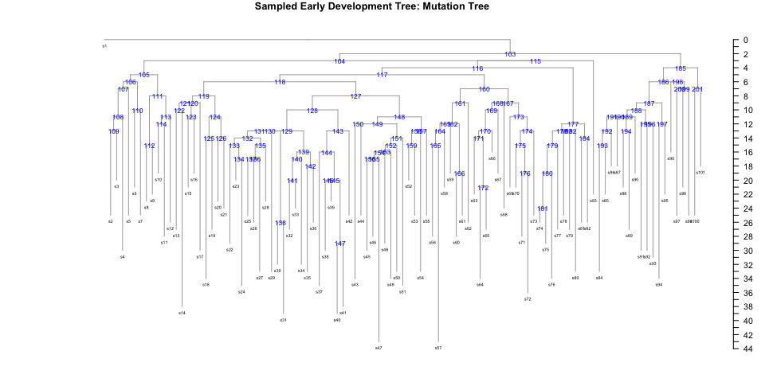 The blue
numbers are represent the ID of the child node associated with each
branch. This “node” ID together with a timestamp is used to locate
events on the tree - see, the *events* data.frame , that is maintained
and updated by the simulator:

``` r
print(sampledtree1m$events)
#>   value driverid node ts uid
#> 1     0        0    1  0   0
#> 2     1        0  103  0   1
```

Notice how here the events dataframe specifies the compartment for the
outgroup and the rest of the tree.

We can introduce another cell compartment as follows:

``` r
cfg=sampledtree1$cfg
cfg=addCellCompartment(cfg,population = 5e4,rate=1/50,ndriver=1,descr="MyTissue",basefit = 0.3)
cfg$compartment$rate[2]=1/120  ## change the rate of compartment 1
sampledtree1a=addDifferentiationEvents(sampledtree1,cfg,2,nEvent=10)
print(sampledtree1a$events)
#>    value driverid node       ts uid
#> 1      0        0    1   0.0000   0
#> 2      1        0  103   0.0000   1
#> 3      2        0   12 123.3047   2
#> 4      2        0   13 123.3047   3
#> 5      2        0   23 123.3047   4
#> 6      2        0   47 123.3047   5
#> 7      2        0   50 123.3047   6
#> 8      2        0   53 123.3047   7
#> 9      2        0   74 123.3047   8
#> 10     2        0   76 123.3047   9
#> 11     2        0   89 123.3047  10
#> 12     2        0   91 123.3047  11
```

The occurence of such events for such sub-sampled trees can be
visualised using the built in function *plot_tree_events*

``` r
plot_tree_events(sampledtree1a)
```


    #> 
    #> Phylogenetic tree with 101 tips and 100 internal nodes.
    #> 
    #> Tip labels:
    #>   s1, s2, s3, s4, s5, s6, ...
    #> 
    #> Rooted; includes branch lengths.

Recall that the config has already been updated with the target
population sizes and division rates. The next phase can therefore be
simulated:

``` r
sp2=sim_pop(sampledtree1a,params=list(n_sim_days=365*10),cfg=sampledtree1a$cfg)
#> n_sim_days: 3650
#> b_stop_if_empty: 0
#> b_stop_at_pop_size: 0
#> maxt: 123.304740911117
#> driver_rate_per_cell_per_day: 0
#> max_driver_count: -1
#> nmigration: 0
#> MAX_EVENTS= 3650000 
#> MAX_SIZE= 310003
plot(sp2)
```


``` r
sampledtree2=get_subsampled_tree(sp2,100)
#> Starting checking the validity of tmp...
#> Found number of tips: n = 101 
#> Found number of nodes: m = 100 
#> Done.
plot_tree_events(sampledtree2,cex.label = 0.5)
```

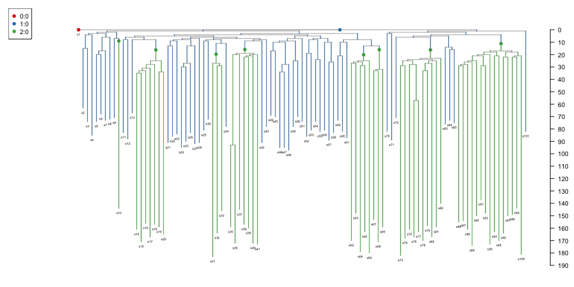

    #> 
    #> Phylogenetic tree with 101 tips and 100 internal nodes.
    #> 
    #> Tip labels:
    #>   s1, s2, s3, s4, s5, s6, ...
    #> 
    #> Rooted; includes branch lengths.

## Wrapper function for neutral simulation

``` r
run_neutral_sim
#> function (initial_division_rate, final_division_rate, target_pop_size = 1e+05, 
#>     nyears = 40) 
#> {
#>     cfg = getDefaultConfig(target_pop_size, rate = initial_division_rate, 
#>         ndriver = 1, basefit = 0)
#>     params = list(n_sim_days = nyears * 365, b_stop_at_pop_size = 1, 
#>         b_stop_if_empty = 0)
#>     growthphase = sim_pop(NULL, params = params, cfg)
#>     cfg$compartment$rate[2] = final_division_rate
#>     cfg$compartment$popsize[2] = target_pop_size
#>     params[["b_stop_at_pop_size"]] = 0
#>     adult1 = sim_pop(growthphase, params = params, cfg)
#>     return(adult1)
#> }
#> <bytecode: 0x131e53318>
#> <environment: namespace:rsimpop>
testing=run_neutral_sim(0.1,0.5/365,target_pop_size = 1e3,nyears=10)
#> n_sim_days: 3650
#> b_stop_if_empty: 0
#> b_stop_at_pop_size: 1
#> maxt: 0
#> driver_rate_per_cell_per_day: 0
#> max_driver_count: -1
#> nmigration: 0
#> MAX_EVENTS= 3650000 
#> MAX_SIZE= 13003 
#> n_sim_days: 3650
#> b_stop_if_empty: 0
#> b_stop_at_pop_size: 0
#> maxt: 80.2098198104107
#> driver_rate_per_cell_per_day: 0
#> max_driver_count: -1
#> nmigration: 0
#> MAX_EVENTS= 3650000 
#> MAX_SIZE= 13003
plot(testing)
```


``` r
st=get_subsampled_tree(testing,100)
#> Starting checking the validity of tmp...
#> Found number of tips: n = 101 
#> Found number of nodes: m = 100 
#> Done.
print(st$cfg$info)
#>   population val fitness id driver1
#> 1          1   0       0  0       0
#> 2        100   1       0  0       0
plot_tree_events(st,cex.label = 0);title("Phylogeny of 100 cells sampled from small population")
#> 
#> Phylogenetic tree with 101 tips and 100 internal nodes.
#> 
#> Tip labels:
#>   s1, s2, s3, s4, s5, s6, ...
#> 
#> Rooted; includes branch lengths.
```


## Selection based simulation

Here we are interested in the simple situation of one cellular
compartment with multiple sub-compartments.

``` r
#run_selection_sim
selsim=run_selection_sim(0.05,1/(2*190),target_pop_size = 5e4,nyears = 50,fitness=0.3)
#> n_sim_days: 5475
#> b_stop_if_empty: 0
#> b_stop_at_pop_size: 1
#> maxt: 0
#> driver_rate_per_cell_per_day: 0
#> max_driver_count: -1
#> nmigration: 0
#> MAX_EVENTS= 5475000 
#> MAX_SIZE= 160003 
#> n_sim_days: 5475
#> b_stop_if_empty: 0
#> b_stop_at_pop_size: 0
#> maxt: 220.952315399144
#> driver_rate_per_cell_per_day: 0
#> max_driver_count: -1
#> nmigration: 0
#> MAX_EVENTS= 5475000 
#> MAX_SIZE= 160003 
#> No driver found: tries= 0 
#>    population val fitness id driver1
#> 1           1   0     0.0  0       0
#> 2       50011   1     0.0  0       0
#> 21          1   1     0.3  1       1
#> n_sim_days: 18250
#> b_stop_if_empty: 1
#> b_stop_at_pop_size: 0
#> maxt: 5475.00243204044
#> driver_rate_per_cell_per_day: 0
#> max_driver_count: -1
#> nmigration: 0
#> MAX_EVENTS= 18250000 
#> MAX_SIZE= 160039 
#> No driver found: tries= 1 
#>    population val fitness id driver1
#> 1           1   0     0.0  0       0
#> 2       50011   1     0.0  0       0
#> 21          1   1     0.3  1       1
#> n_sim_days: 18250
#> b_stop_if_empty: 1
#> b_stop_at_pop_size: 0
#> maxt: 5475.00243204044
#> driver_rate_per_cell_per_day: 0
#> max_driver_count: -1
#> nmigration: 0
#> MAX_EVENTS= 18250000 
#> MAX_SIZE= 160039 
#> No driver found: tries= 2 
#>    population val fitness id driver1
#> 1           1   0     0.0  0       0
#> 2       50011   1     0.0  0       0
#> 21          1   1     0.3  1       1
#> n_sim_days: 18250
#> b_stop_if_empty: 1
#> b_stop_at_pop_size: 0
#> maxt: 5475.00243204044
#> driver_rate_per_cell_per_day: 0
#> max_driver_count: -1
#> nmigration: 0
#> MAX_EVENTS= 18250000 
#> MAX_SIZE= 160039
print(selsim$cfg$info)
#>   population val fitness id driver1
#> 1          1   0     0.0  0       0
#> 2      45521   1     0.0  0       0
#> 3       4504   1     0.3  1       0
```

Plot example sampled trees using various brach length models (or
scaling):

``` r
seltree100=get_subsampled_tree(selsim,100)
#> Starting checking the validity of tmp...
#> Found number of tips: n = 101 
#> Found number of nodes: m = 100 
#> Done.
print(seltree100$cfg$info)
#>   population val fitness id driver1
#> 1          1   0     0.0  0       0
#> 2         95   1     0.0  0       0
#> 3          5   1     0.3  1       0
plot_tree_events(seltree100,cex.label = 0);title("Selection Based Tree: Branch Length=#Self Renewal Divisions")
#> 
#> Phylogenetic tree with 101 tips and 100 internal nodes.
#> 
#> Tip labels:
#>   s1, s2, s3, s4, s5, s6, ...
#> 
#> Rooted; includes branch lengths.
```

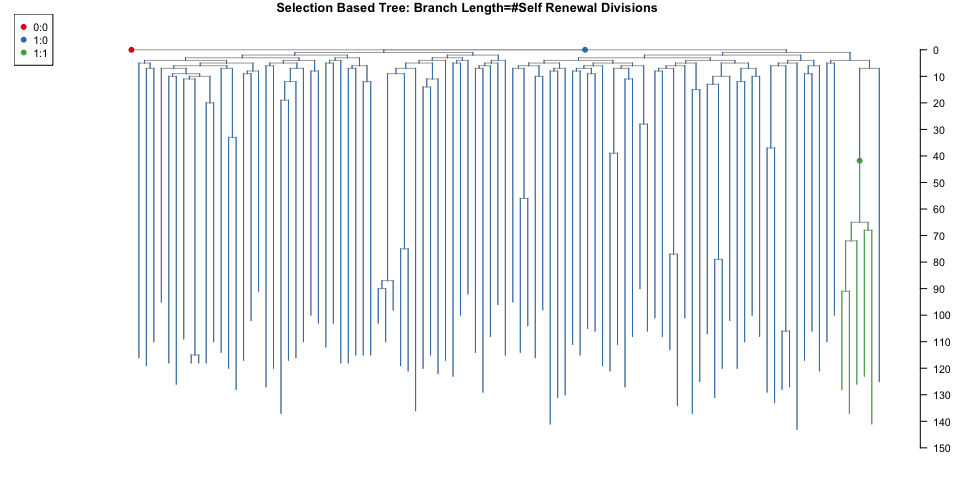

``` r
seltree100rt=get_elapsed_time_tree(seltree100)
tree=plot_tree_events(seltree100rt,cex.label = 0);title("Selection Based Tree: Branch Length=#Real Time")
```

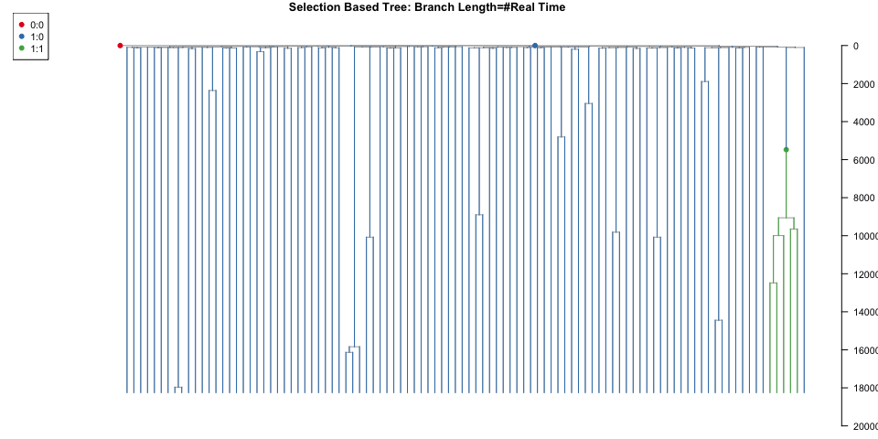

``` r
mp=5
seltree100m=get_elapsed_time_tree(seltree100,mutrateperdivision=mp,backgroundrate=(20-(365/190)*mp)/365)
plot_tree_events(seltree100m,cex.label = 0.5);title("Selection Based Tree: Branch Length=#Mutations")
#> 
#> Phylogenetic tree with 101 tips and 100 internal nodes.
#> 
#> Tip labels:
#>   s1, s2, s3, s4, s5, s6, ...
#> 
#> Rooted; includes branch lengths.
```

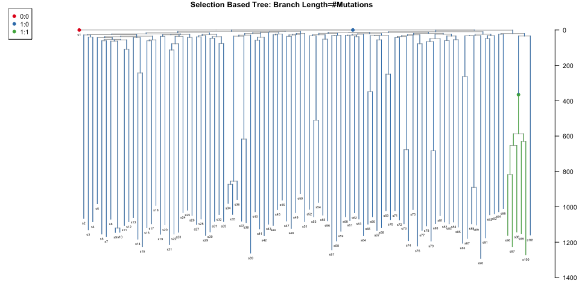

``` r
seltree100m2=get_elapsed_time_tree(seltree100,mutrateperdivision=20*(190/365),backgroundrate=0)
plot_tree_events(seltree100m2,cex.label = 0.5);title("Selection Based Tree: Branch Length=#Mutations v2")
#> 
#> Phylogenetic tree with 101 tips and 100 internal nodes.
#> 
#> Tip labels:
#>   s1, s2, s3, s4, s5, s6, ...
#> 
#> Rooted; includes branch lengths.
```

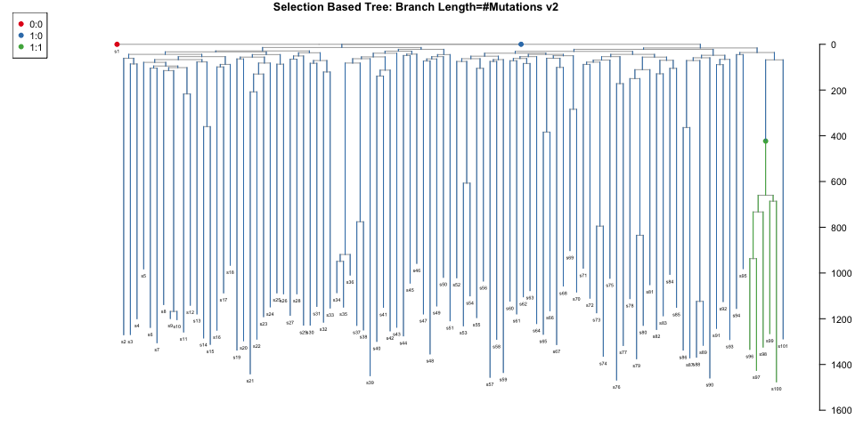

## Transient selection

``` r
#run_transient_selection
tselsim=run_transient_selection(0.05,1/(2*190),target_pop_size = 5e4,nyears_driver_acquisition=15,
                                  nyears_transient_end=30,
                                  nyears=50,
                                  fitness=0.5)
#> n_sim_days: 5475
#> b_stop_if_empty: 0
#> b_stop_at_pop_size: 1
#> maxt: 0
#> driver_rate_per_cell_per_day: 0
#> max_driver_count: -1
#> nmigration: 0
#> MAX_EVENTS= 5475000 
#> MAX_SIZE= 160003 
#> n_sim_days: 5475
#> b_stop_if_empty: 0
#> b_stop_at_pop_size: 0
#> maxt: 213.631482316392
#> driver_rate_per_cell_per_day: 0
#> max_driver_count: -1
#> nmigration: 0
#> MAX_EVENTS= 5475000 
#> MAX_SIZE= 160003 
#> No driver found: tries= 0 
#>    population val fitness id driver1
#> 1           1   0     0.0  0       0
#> 2       50017   1     0.0  0       0
#> 21          1   1     0.5  1       1
#> n_sim_days: 10950
#> b_stop_if_empty: 1
#> b_stop_at_pop_size: 0
#> maxt: 5475.00435862613
#> driver_rate_per_cell_per_day: 0
#> max_driver_count: -1
#> nmigration: 0
#> MAX_EVENTS= 10950000 
#> MAX_SIZE= 160057 
#> No driver found: tries= 1 
#>    population val fitness id driver1
#> 1           1   0     0.0  0       0
#> 2       50017   1     0.0  0       0
#> 21          1   1     0.5  1       1
#> n_sim_days: 10950
#> b_stop_if_empty: 1
#> b_stop_at_pop_size: 0
#> maxt: 5475.00435862613
#> driver_rate_per_cell_per_day: 0
#> max_driver_count: -1
#> nmigration: 0
#> MAX_EVENTS= 10950000 
#> MAX_SIZE= 160057 
#> No driver found: tries= 2 
#>    population val fitness id driver1
#> 1           1   0     0.0  0       0
#> 2       50017   1     0.0  0       0
#> 21          1   1     0.5  1       1
#> n_sim_days: 10950
#> b_stop_if_empty: 1
#> b_stop_at_pop_size: 0
#> maxt: 5475.00435862613
#> driver_rate_per_cell_per_day: 0
#> max_driver_count: -1
#> nmigration: 0
#> MAX_EVENTS= 10950000 
#> MAX_SIZE= 160057 
#> No driver found: tries= 3 
#>    population val fitness id driver1
#> 1           1   0     0.0  0       0
#> 2       50017   1     0.0  0       0
#> 21          1   1     0.5  1       1
#> n_sim_days: 10950
#> b_stop_if_empty: 1
#> b_stop_at_pop_size: 0
#> maxt: 5475.00435862613
#> driver_rate_per_cell_per_day: 0
#> max_driver_count: -1
#> nmigration: 0
#> MAX_EVENTS= 10950000 
#> MAX_SIZE= 160057 
#> No driver found: tries= 4 
#>    population val fitness id driver1
#> 1           1   0     0.0  0       0
#> 2       50017   1     0.0  0       0
#> 21          1   1     0.5  1       1
#> n_sim_days: 10950
#> b_stop_if_empty: 1
#> b_stop_at_pop_size: 0
#> maxt: 5475.00435862613
#> driver_rate_per_cell_per_day: 0
#> max_driver_count: -1
#> nmigration: 0
#> MAX_EVENTS= 10950000 
#> MAX_SIZE= 160057 
#> No driver found: tries= 5 
#>    population val fitness id driver1
#> 1           1   0     0.0  0       0
#> 2       50017   1     0.0  0       0
#> 21          1   1     0.5  1       1
#> n_sim_days: 10950
#> b_stop_if_empty: 1
#> b_stop_at_pop_size: 0
#> maxt: 5475.00435862613
#> driver_rate_per_cell_per_day: 0
#> max_driver_count: -1
#> nmigration: 0
#> MAX_EVENTS= 10950000 
#> MAX_SIZE= 160057 
#> No driver found: tries= 6 
#>    population val fitness id driver1
#> 1           1   0     0.0  0       0
#> 2       50017   1     0.0  0       0
#> 21          1   1     0.5  1       1
#> n_sim_days: 10950
#> b_stop_if_empty: 1
#> b_stop_at_pop_size: 0
#> maxt: 5475.00435862613
#> driver_rate_per_cell_per_day: 0
#> max_driver_count: -1
#> nmigration: 0
#> MAX_EVENTS= 10950000 
#> MAX_SIZE= 160057 
#> No driver found: tries= 7 
#>    population val fitness id driver1
#> 1           1   0     0.0  0       0
#> 2       50017   1     0.0  0       0
#> 21          1   1     0.5  1       1
#> n_sim_days: 10950
#> b_stop_if_empty: 1
#> b_stop_at_pop_size: 0
#> maxt: 5475.00435862613
#> driver_rate_per_cell_per_day: 0
#> max_driver_count: -1
#> nmigration: 0
#> MAX_EVENTS= 10950000 
#> MAX_SIZE= 160057 
#> n_sim_days: 18250
#> b_stop_if_empty: 1
#> b_stop_at_pop_size: 0
#> maxt: 10950.0041428909
#> driver_rate_per_cell_per_day: 0
#> max_driver_count: -1
#> nmigration: 0
#> MAX_EVENTS= 18250000 
#> MAX_SIZE= 160039
tseltree200=get_subsampled_tree(tselsim,200)
#> Starting checking the validity of tmp...
#> Found number of tips: n = 201 
#> Found number of nodes: m = 200 
#> Done.
plot_tree_events(get_elapsed_time_tree(tseltree200),cex.label=0)
```


    #> 
    #> Phylogenetic tree with 201 tips and 200 internal nodes.
    #> 
    #> Tip labels:
    #>   s1, s2, s3, s4, s5, s6, ...
    #> 
    #> Rooted; includes branch lengths.

## Neutral simulation with a trajectory

Create a trajectory dataframe with 3 columns
(ts,target_pop_size,division_rate) and simulate using the
run_neutral_trajectory wrapper function. Note that timestamps and rates
are expressed in units of days and expected divisions per day
respectively.

``` r
trajectory=data.frame(ts=365*(1:80),target_pop_size=5e4+100*(1:80),division_rate=1/(2*190))
trajectory$target_pop_size[5:10]=2*trajectory$target_pop_size[5:10]
trajectory$target_pop_size[11:15]=0.2*trajectory$target_pop_size[11:15]
print(head(trajectory))
#>     ts target_pop_size division_rate
#> 1  365           50100   0.002631579
#> 2  730           50200   0.002631579
#> 3 1095           50300   0.002631579
#> 4 1460           50400   0.002631579
#> 5 1825          101000   0.002631579
#> 6 2190          101200   0.002631579
sp=run_neutral_trajectory(NULL,0.5,trajectory)
#> cell population will be modelled based on provided trajectory
#> n_sim_days: 365
#> b_stop_if_empty: 0
#> b_stop_at_pop_size: 1
#> maxt: 0
#> driver_rate_per_cell_per_day: 0
#> max_driver_count: -1
#> nmigration: 0
#> MAX_EVENTS= 365000 
#> MAX_SIZE= 160303 
#> n_sim_days: 20.7643134339581
#> b_stop_if_empty: 0
#> b_stop_at_pop_size: 0
#> maxt: 20.7643134339581
#> driver_rate_per_cell_per_day: 0
#> max_driver_count: -1
#> nmigration: 0
#> MAX_EVENTS= 292000 
#> MAX_SIZE= 316003
plot(sp,xlim=c(0,100))
lines(trajectory$ts/365,trajectory$target_pop_size,col="red")
legend("topright",c("Target","Actual"),col=c("red","black"),lwd=1)
```

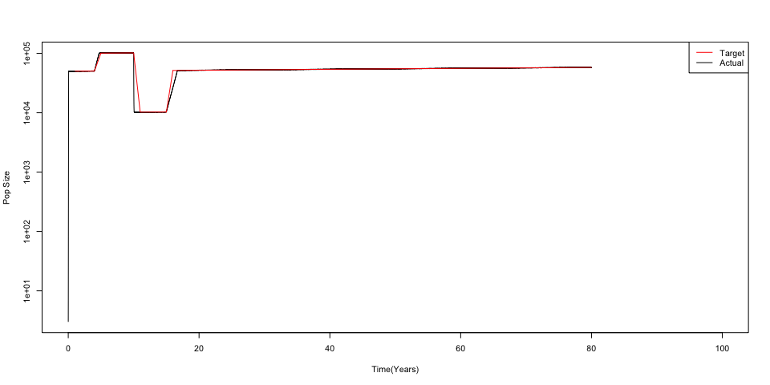

``` r
st=get_subsampled_tree(sp,100)
#> Starting checking the validity of tmp...
#> Found number of tips: n = 101 
#> Found number of nodes: m = 100 
#> Done.
plot_tree(get_elapsed_time_tree(st),cex.label = 0)
```

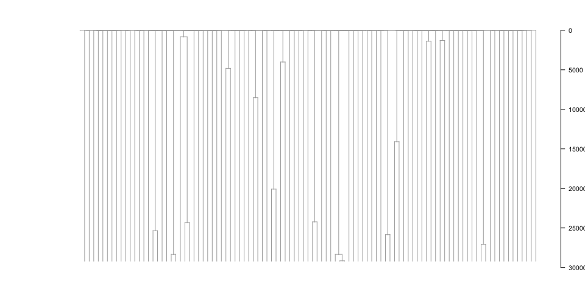

    #> 
    #> Phylogenetic tree with 101 tips and 100 internal nodes.
    #> 
    #> Tip labels:
    #>   s1, s2, s3, s4, s5, s6, ...
    #> 
    #> Rooted; includes branch lengths.

## Neutral simulation with a trajectory and a non-zero death rate

By default during the growth phase of the simulation the population is a
pure birth process until the target population is hit at which point the
aggregate death rate is set to match the aggregate birth rate. A death
rate (less than birth rate) can also be specified in the trajectory and
the population will then stochastically grow exponentially towards the
target following a birth-death process.

``` r
trajectory=data.frame(ts=c(70,400),target_pop_size=c(1e4,1e4),division_rate=c(0.06,0.06),death_rate=c(0.05,0.05))
print(head(trajectory))
#>    ts target_pop_size division_rate death_rate
#> 1  70           10000          0.06       0.05
#> 2 400           10000          0.06       0.05
sp=run_neutral_trajectory(NULL,initial_division_rate = 0.1,trajectory = trajectory)
#> cell population will be modelled based on provided trajectory
#> n_sim_days: 70
#> b_stop_if_empty: 0
#> b_stop_at_pop_size: 1
#> maxt: 0
#> driver_rate_per_cell_per_day: 0
#> max_driver_count: -1
#> nmigration: 0
#> MAX_EVENTS= 70000 
#> MAX_SIZE= 40003 
#> n_sim_days: 70.0151374827015
#> b_stop_if_empty: 0
#> b_stop_at_pop_size: 0
#> maxt: 70.0151374827015
#> driver_rate_per_cell_per_day: 0
#> max_driver_count: -1
#> nmigration: 0
#> MAX_EVENTS= 4000 
#> MAX_SIZE= 40003
plot(sp)
lines(trajectory$ts,trajectory$target_pop_size,col="red")
legend("topright",c("Target","Actual"),col=c("red","black"),lwd=1)
abline(v=trajectory$ts,lwd=2,col="blue")
```

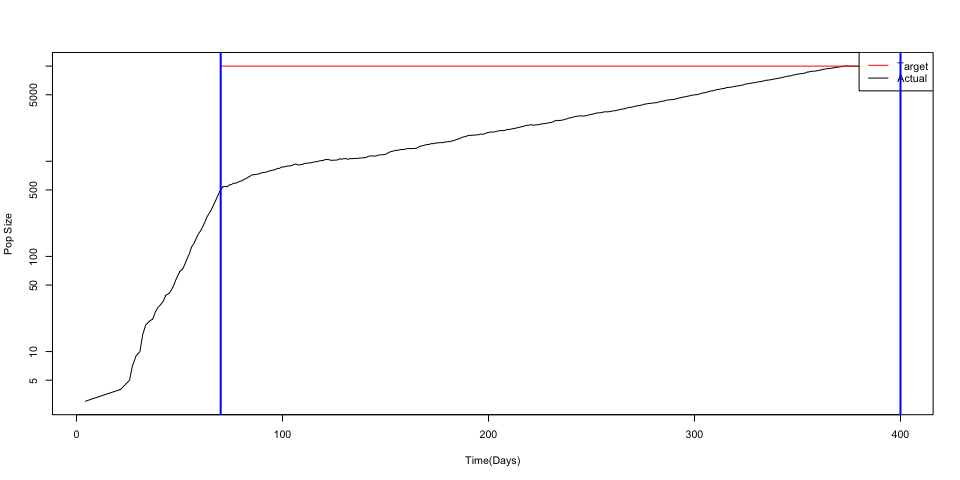

``` r
st=get_subsampled_tree(sp,200)
#> Starting checking the validity of tmp...
#> Found number of tips: n = 201 
#> Found number of nodes: m = 200 
#> Done.
plot_tree(get_elapsed_time_tree(st),cex.label = 0)
```


    #> 
    #> Phylogenetic tree with 201 tips and 200 internal nodes.
    #> 
    #> Tip labels:
    #>   s1, s2, s3, s4, s5, s6, ...
    #> 
    #> Rooted; includes branch lengths.

## Multiple drivers

Multiple drivers can be generated at a specified rate so the waiting
time between events is exponentially distributed.

Firstly the user need to create a function that draws a selection
coefficient from a distibution. The simulator can comfortably
accommodate over 100 drivers per year but nonetheless it is advised that
a selection coefficient threshold be specified (say 0.05) and that
driver incidence be made correspondingly rarer. Note that at least
200,000 fitness coefficent values need to provided to
run_driver_process_sim.

### Selection coefficient specification

``` r
##Function to generate exponential distribution based fitness
require("truncdist")
genExpFitness=function(fitness_threshold,rate){
    function() rtrunc(n=1,a=fitness_threshold, b=Inf,"exp",rate=rate)
}
fitnessExpFn=genExpFitness(fitness_threshold=0.08,rate=40)
hist(sapply(1:10000,function(x) exp(fitnessExpFn())-1),breaks=seq(0,100,0.01),xlim=c(0,1),xlab="Selection Coefficient Per Year",main="Sampled Selection Cofficent Distribution")
```


### Run the multiple driver simulation

Introduce one driver per year

``` r
dps=run_driver_process_sim(simpop=NULL,initial_division_rate = 0.1,final_division_rate = 1/(2*190),target_pop_size = 1e5,nyears = 80,fitness=fitnessExpFn,drivers_per_cell_per_day = 1/(365*1e5))
```

Look at the final per driver counts

``` r
print(dps$cfg$info %>% filter(population>0))
#>    population val    fitness id driver1
#> 1           1   0 0.00000000  0       0
#> 2       88200   1 0.00000000  0       0
#> 3        2576   1 0.11060873  8       0
#> 4        3858   1 0.11054592 20       0
#> 5         787   1 0.08258794 26       0
#> 6        2661   1 0.09181864  6       0
#> 7         615   1 0.09714999 28       0
#> 8         698   1 0.08010027 37       0
#> 9           4   1 0.10144519 51       0
#> 10        403   1 0.19702666 44       0
#> 11        120   1 0.10807601 41       0
#> 12         10   1 0.11772413 76       0
#> 13         15   1 0.17391097 62       0
#> 14          4   1 0.28992034 83       0
#> 15         16   1 0.12372851 60       0
#> 16         48   1 0.11243198 61       0
```

Plot an example sampled tree

``` r
dpst=get_subsampled_tree(dps,200)
#> Starting checking the validity of tmp...
#> Found number of tips: n = 201 
#> Found number of nodes: m = 200 
#> Done.
dpst=get_elapsed_time_tree(dpst)
plot_tree_events(dpst)
```

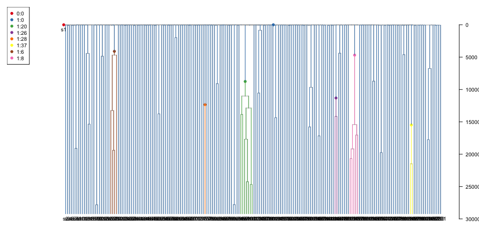

    #> 
    #> Phylogenetic tree with 201 tips and 200 internal nodes.
    #> 
    #> Tip labels:
    #>   s1, s2, s3, s4, s5, s6, ...
    #> 
    #> Rooted; includes branch lengths.
    dpst=get_elapsed_time_tree(dpst,mutrateperdivision = 1,backgroundrate = 19/365)
    plot_tree_events(dpst,cex.label = 0,fmode=1)


    #> 
    #> Phylogenetic tree with 201 tips and 200 internal nodes.
    #> 
    #> Tip labels:
    #>   s1, s2, s3, s4, s5, s6, ...
    #> 
    #> Rooted; includes branch lengths.

Continue simulating the same individual until the age of 90

``` r
#dps90=continue_driver_process_sim(dps,25,fitness_gen=fitnessExpFn(),drivers_per_year = 0.5)  ##continue_driver_process_sim(dps,90,fitnessGen =fitnessExpFn(),)
dps90=run_driver_process_sim(simpop=dps,initial_division_rate = 0.1,final_division_rate = 1/(2*190),target_pop_size = 1e5,nyears = 90,fitness=fitnessExpFn,drivers_per_cell_per_day = 1/(365*1e5))
```

Note that as of version 2.0.0 driver ids are not reused so they are now
preserved between runs.

``` r
dpst90=get_subsampled_tree(dps90,200)
#> Starting checking the validity of tmp...
#> Found number of tips: n = 201 
#> Found number of nodes: m = 200 
#> Done.
dpst90=get_elapsed_time_tree(dpst90)
plot_tree_events(dpst90,cex.label = 0)
```


    #> 
    #> Phylogenetic tree with 201 tips and 200 internal nodes.
    #> 
    #> Tip labels:
    #>   s1, s2, s3, s4, s5, s6, ...
    #> 
    #> Rooted; includes branch lengths.

If desired the colouring can be kept consistent across 2 plots from
different times (experimental) using the events.keep argument:

``` r
par(mfcol=c(2,1))
zz=plot_tree_events(dpst,fmode=1,cex.label = 0)
yy=plot_tree_events(dpst90,fmode=1,events.keep = zz$events,cex.label = 0)
```

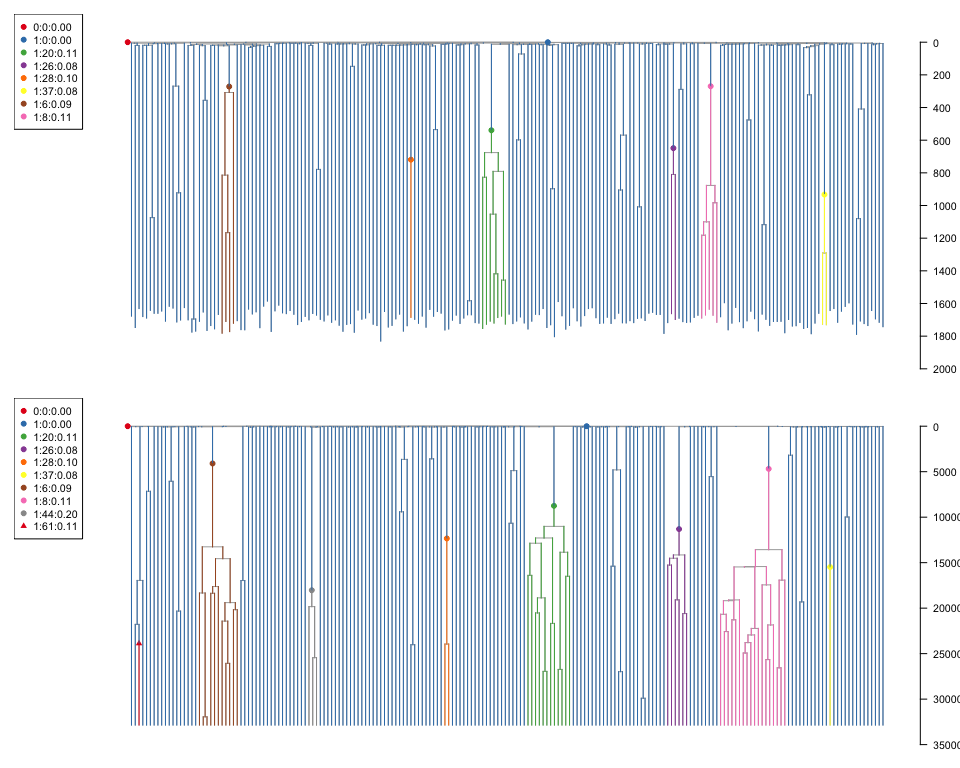

## Multiple drivers with Trajectory

``` r
trajectory=data.frame(ts=365*(1:80),target_pop_size=5e4+100*(1:80),division_rate=1/(2*190),compartment=1)
trajectory$target_pop_size[15:20]=2*trajectory$target_pop_size[15:20]
trajectory$target_pop_size[21:25]=0.2*trajectory$target_pop_size[21:25]
dps=run_driver_process_sim(initial_division_rate=0.1,user_trajectory=trajectory, target_pop_size = 1e5,nyears = 80,
                           fitnessGen=fitnessExpFn,drivers_per_cell_per_day = 1/(365*1e5))

plot(dps,xlim=c(0,100))
lines(trajectory$ts/365,trajectory$target_pop_size,col="red")
legend("topright",c("Target","Actual"),col=c("red","black"),lwd=1)
```


``` r
dpst=get_subsampled_tree(dps,200)
#> Starting checking the validity of tmp...
#> Found number of tips: n = 201 
#> Found number of nodes: m = 200 
#> Done.
dpst=get_elapsed_time_tree(dpst)
plot_tree_events(dpst,cex.label = 0)
```


    #> 
    #> Phylogenetic tree with 201 tips and 200 internal nodes.
    #> 
    #> Tip labels:
    #>   s1, s2, s3, s4, s5, s6, ...
    #> 
    #> Rooted; includes branch lengths.

## Modelling continuous differentiation/migration between cellular compartments

``` r
cfg=getDefaultConfig(target_pop_size  = 1e4,rate = 0.1)
print(cfg)
#> $compartment
#>   val rate death_rate popsize      desc
#> 1   0 -1.0          0       1  outgroup
#> 2   1  0.1          0   10000 cellType1
#> 
#> $info
#>   val population fitness id driver1
#> 1   0          0       0  0       0
#> 2   1          0       0  0       0
#> 
#> $drivers
#>   val driver fitness
#> 1   1      1       0
#> 
#> $migrations
#> [1] c1    c2    arate srate
#> <0 rows> (or 0-length row.names)
cfg$compartment$desc[2]="EMB"
##Simulate rapid growth before HSC specification
sp=sim_pop(NULL,params=list(n_sim_days=365*1,b_stop_at_pop_size=1),cfg=cfg)
#> n_sim_days: 365
#> b_stop_if_empty: 0
#> b_stop_at_pop_size: 1
#> maxt: 0
#> driver_rate_per_cell_per_day: 0
#> max_driver_count: -1
#> nmigration: 0
#> MAX_EVENTS= 365000 
#> MAX_SIZE= 40003
##We say the HSC pool is started with 50 cells
HSC_INIT_POP=50
sp=get_subsampled_tree(sp,HSC_INIT_POP)
#> Starting checking the validity of tmp...
#> Found number of tips: n = 51 
#> Found number of nodes: m = 50 
#> Done.
cfg=sp$cfg
cfg=addCellCompartment(cfg,population = 5e4,rate=0.02,descr="HSC")
cfg=addCellCompartment(cfg,population = 5e5,rate=0.04,descr="MPP")
cfg$compartment$rate[2]=c(-1)  ## change the rate of compartment 1
cfg$compartment$popsize[2]=c(0) ## switch off EMB compartment
sp=addDifferentiationEvents(sp,cfg,2,nEvent=HSC_INIT_POP,currentCompartment = 1)
## Specify the HSC->MPP migrations (just symmetric at a low rate)
sp$cfg$migrations=data.frame(c1=c(2),## source: HSC
                             c2=c(3),## sink: MPP
                             arate=c(0), ## asymmetric diff rate
                             srate=c(0.001) ## symmetric diff rate
                             )
sp=sim_pop(sp,params=list(n_sim_days=2*365),cfg=sp$cfg)
#> n_sim_days: 730
#> b_stop_if_empty: 0
#> b_stop_at_pop_size: 0
#> maxt: 118.404207514795
#> driver_rate_per_cell_per_day: 0
#> max_driver_count: -1
#> nmigration: 0
#> MAX_EVENTS= 730000 
#> MAX_SIZE= 1660003
plot_compartment_trajectory(sp)
#> Joining with `by = join_by(compartment)`
```

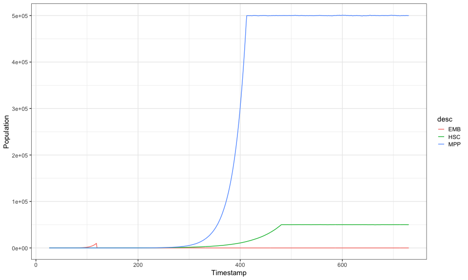

``` r
plot_compartment_trajectory(sp)+scale_y_log10()
#> Joining with `by = join_by(compartment)`
#> Warning: Transformation introduced infinite values in continuous y-axis
```

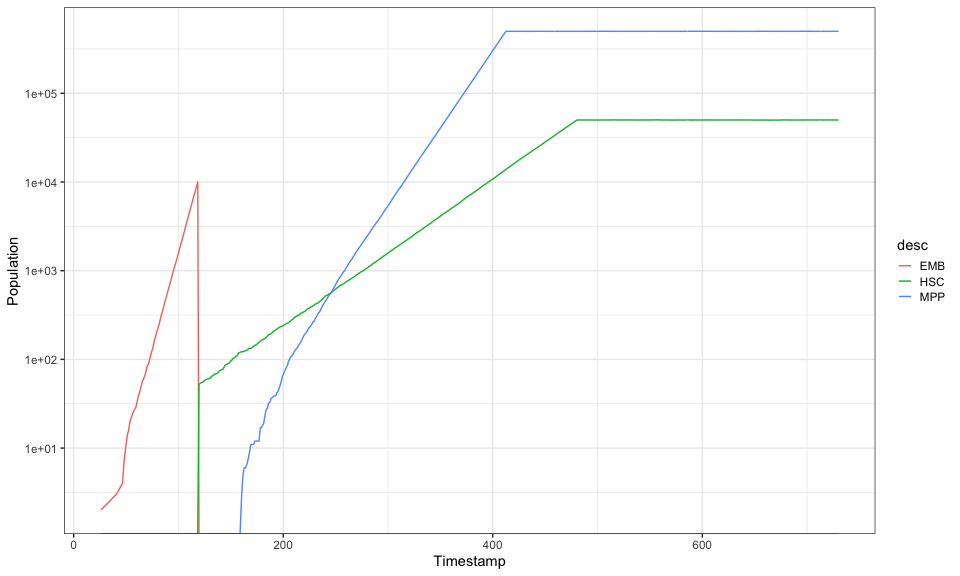

``` r
st=get_subsampled_tree_fixed_compartmentcount(sp,compartments = c(2,3),counts=c(150,150))
#> Starting checking the validity of tmp...
#> Found number of tips: n = 301 
#> Found number of nodes: m = 300 
#> Done.
plot_tree_events(get_elapsed_time_tree(st,0,50/365),cex.label=0,use.desc=TRUE)
```


    #> 
    #> Phylogenetic tree with 301 tips and 300 internal nodes.
    #> 
    #> Tip labels:
    #>   s1, s2, s3, s4, s5, s6, ...
    #> 
    #> Rooted; includes branch lengths.
